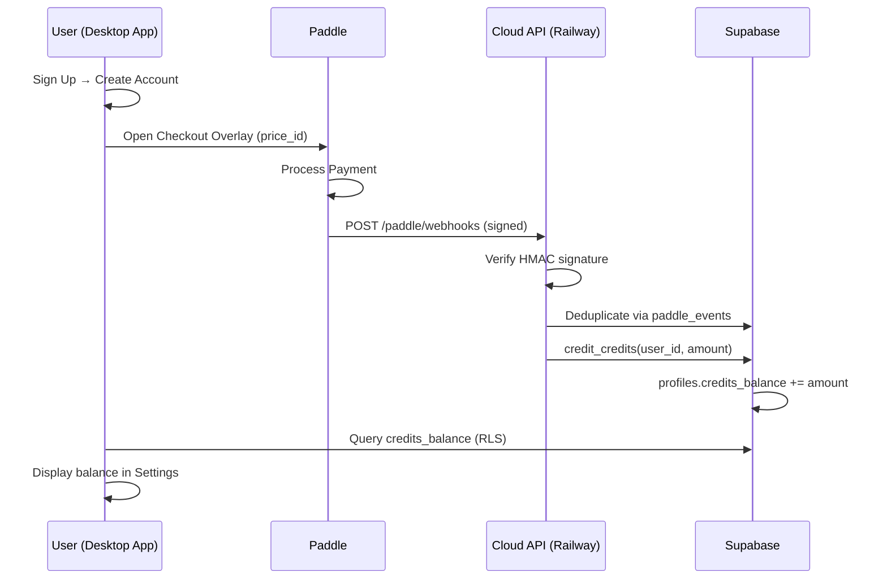

# PipeFX Paddle Billing Integration — Developer Handoff

> **Date:** 2026-04-28  
> **Scope:** Full Paddle Billing integration into PipeFX Desktop + Cloud API  
> **Status:** Production-deployed, pending first live transaction verification

---

## 1. Architecture Overview



### Key Principle
The Desktop App **never talks to the Cloud API for billing**. It talks directly to:
- **Paddle** (via `@paddle/paddle-js` overlay checkout) for payment processing
- **Supabase** (via RLS) for reading credit balance and subscription status

The Cloud API only receives **webhooks from Paddle** to provision credits.

---

## 2. Subscription Plans

| Plan | Price | Credits/mo | Paddle Price ID |
|------|-------|-----------|-----------------|
| Starter | $10/mo | 100,000 | `pri_01kq8gpgmnvxzgm5vbhqcvmsvh` |
| Creator | $30/mo | 300,000 | `pri_01kq8gsa26ej1rjnzmzng215gq` |
| Studio | $100/mo | 700,000 | `pri_01kq8gwf6vjt1syhah5wacv334` |

> [!IMPORTANT]
> These prices are **hardcoded** in two places: [LoginPage.tsx](file:///c:/Users/DSNah/Downloads/pipefx-build-2026.04.24/pipefx-develop-current/apps/desktop/src/features/auth/LoginPage.tsx) (sign-up flow) and [SettingsPage.tsx](file:///c:/Users/DSNah/Downloads/pipefx-build-2026.04.24/pipefx-develop-current/apps/desktop/src/features/settings/SettingsPage.tsx) (plan management). If prices change in Paddle, update both files' `PLANS` / `CLOUD_PLANS` arrays.

---

## 3. Files Modified / Created

### Desktop App (`apps/desktop/`)

| File | What Changed |
|------|-------------|
| [LoginPage.tsx](file:///c:/Users/DSNah/Downloads/pipefx-build-2026.04.24/pipefx-develop-current/apps/desktop/src/features/auth/LoginPage.tsx) | Complete redesign — side-by-side layout: account form (left) + optional CloudFX/BYOK (right). Plans trigger Paddle overlay on signup. |
| [PaddleCheckout.ts](file:///c:/Users/DSNah/Downloads/pipefx-build-2026.04.24/pipefx-develop-current/apps/desktop/src/features/auth/PaddleCheckout.ts) | **New.** React hook wrapping `@paddle/paddle-js`. Initializes SDK, opens overlay checkout, handles events. |
| [SettingsPage.tsx](file:///c:/Users/DSNah/Downloads/pipefx-build-2026.04.24/pipefx-develop-current/apps/desktop/src/features/settings/SettingsPage.tsx) | Cloud mode section: removed Device Token, added credit balance widget (direct Supabase query), added plan picker with Paddle checkout, shows active/subscribe state. |
| [.env](file:///c:/Users/DSNah/Downloads/pipefx-build-2026.04.24/pipefx-develop-current/apps/desktop/.env) | Added `VITE_PADDLE_CLIENT_TOKEN`, `VITE_PADDLE_ENV`, `VITE_PADDLE_PRICE_*` |
| [.env.example](file:///c:/Users/DSNah/Downloads/pipefx-build-2026.04.24/pipefx-develop-current/apps/desktop/.env.example) | Template with placeholder Paddle variables |

### Cloud API (`PipeFX-Cloud-API/`)

| File | What Changed |
|------|-------------|
| [main.ts](file:///c:/Users/DSNah/Downloads/pipefx-build-2026.04.24/PipeFX-Cloud-API/src/main.ts) | Registered `POST /paddle/webhooks` route, raw body parsing for HMAC verification |
| [paddle-webhooks.ts](file:///c:/Users/DSNah/Downloads/pipefx-build-2026.04.24/PipeFX-Cloud-API/src/services/paddle-webhooks.ts) | **New.** Full webhook handler: HMAC verification, event deduplication, subscription lifecycle (created/updated/canceled/past_due), credit provisioning via Supabase RPCs |
| [config.ts](file:///c:/Users/DSNah/Downloads/pipefx-build-2026.04.24/PipeFX-Cloud-API/src/config.ts) | Added `paddleApiKey`, `paddleWebhookSecret`, `paddleEnv` |

### Database (`supabase/migrations/`)

| File | What Changed |
|------|-------------|
| [003_paddle_billing.sql](file:///c:/Users/DSNah/Downloads/pipefx-build-2026.04.24/pipefx-develop-current/supabase/migrations/003_paddle_billing.sql) | **New.** Adds paddle columns to `profiles` and `products`, creates `paddle_events` idempotency table |

---

## 4. Database Schema Changes

### `profiles` table — new columns
```sql
paddle_customer_id     TEXT          -- Paddle customer ID (set by webhook)
paddle_subscription_id TEXT          -- Paddle subscription ID
subscription_status    TEXT DEFAULT 'none'
  -- Enum: 'none', 'active', 'past_due', 'paused', 'canceled', 'trialing'
```

### `products` table — new columns
```sql
paddle_price_id   TEXT UNIQUE       -- e.g. 'pri_01kq8gpgmnvxzgm5vbhqcvmsvh'
paddle_product_id TEXT              -- Paddle product ID (optional)
billing_interval  TEXT DEFAULT 'month'  -- 'month', 'year', 'one_time'
```

### `paddle_events` table — new
```sql
id         TEXT PRIMARY KEY    -- Paddle notification_id (deduplication key)
type       TEXT NOT NULL       -- Event type (e.g. 'subscription.created')
data       JSONB               -- Full event payload
processed  BOOLEAN DEFAULT false
created_at TIMESTAMPTZ
```

> [!NOTE]
> The migration has been **applied to production Supabase**. The `paddle_events` table has RLS enabled with no public policies — only `service_role` (used by the Cloud API) can read/write.

---

## 5. Environment Variables

### Desktop App (`.env`)
```bash
VITE_PADDLE_CLIENT_TOKEN=live_941c369ec61e3641535262956f3
VITE_PADDLE_ENV=production
VITE_PADDLE_PRICE_STARTER=pri_01kq8gpgmnvxzgm5vbhqcvmsvh
VITE_PADDLE_PRICE_CREATOR=pri_01kq8gsa26ej1rjnzmzng215gq
VITE_PADDLE_PRICE_STUDIO=pri_01kq8gwf6vjt1syhah5wacv334
```

### Cloud API (Railway)
```bash
PADDLE_API_KEY=<server-side Paddle API key>
PADDLE_WEBHOOK_SECRET=<endpoint secret from Paddle webhook destination>
PADDLE_ENV=production
```

> [!CAUTION]
> The `PADDLE_API_KEY` and `PADDLE_WEBHOOK_SECRET` are **server-side secrets**. Never expose in client code. The `VITE_PADDLE_CLIENT_TOKEN` (prefixed `live_`) is safe for client-side, equivalent to Stripe's publishable key.

---

## 6. Webhook Flow (Deep Dive)

### Endpoint: `POST /paddle/webhooks`

**Location:** [main.ts:344-360](file:///c:/Users/DSNah/Downloads/pipefx-build-2026.04.24/PipeFX-Cloud-API/src/main.ts#L344-L360)  
**Handler:** [paddle-webhooks.ts](file:///c:/Users/DSNah/Downloads/pipefx-build-2026.04.24/PipeFX-Cloud-API/src/services/paddle-webhooks.ts)

**Processing steps:**
1. **Raw body capture** — body collected as raw string (not JSON-parsed) for HMAC
2. **Signature verification** — `paddle-signature` header → `ts=<timestamp>;h1=<hmac>` → verified against `PADDLE_WEBHOOK_SECRET`
3. **Idempotency check** — `notification_id` checked against `paddle_events` table
4. **Event dispatch:**

| Event | Action |
|-------|--------|
| `subscription.created` | Set `subscription_status='active'`, `paddle_subscription_id`, credit initial credits via `credit_credits()` RPC |
| `subscription.updated` | Map Paddle status → our enum, update `subscription_status` |
| `subscription.canceled` | Set `subscription_status='canceled'` |
| `subscription.past_due` | Set `subscription_status='past_due'` |
| `transaction.completed` | Credit renewal credits (same `credit_credits()` RPC with different idempotency key) |
| `transaction.payment_failed` | Log failure |

### Credit Provisioning
Credits are added via the existing Supabase RPC `credit_credits()` (from migration `002_credits_and_usage.sql`), which atomically increments `profiles.credits_balance` and creates a `credit_ledger` entry.

---

## 7. UI Components

### Sign-Up Flow ([LoginPage.tsx](file:///c:/Users/DSNah/Downloads/pipefx-build-2026.04.24/pipefx-develop-current/apps/desktop/src/features/auth/LoginPage.tsx))

**Layout:** Side-by-side when in sign-up mode, single centered card for sign-in.

- **Left column:** Email, Password, Confirm Password, Create Account button, Google OAuth, mode toggle
- **Right column:** Optional card with two accordion sections:
  - **CloudFX Subscription** — Radio-style plan picker (Starter/Creator/Studio)
  - **Bring Your Own Keys** — Gemini/OpenAI/Anthropic key inputs

**Behavior on submit:**
1. Creates Supabase account
2. Saves BYOK keys locally if provided
3. Opens Paddle checkout overlay if CloudFX plan was selected

### Settings Cloud Mode ([SettingsPage.tsx](file:///c:/Users/DSNah/Downloads/pipefx-build-2026.04.24/pipefx-develop-current/apps/desktop/src/features/settings/SettingsPage.tsx))

When user selects "PipeFX Cloud" mode:
- **Credit Balance widget** — queries `profiles.credits_balance` directly via Supabase RLS, with Refresh button
- **Plan picker** — 3-column card grid, "Subscribe" or "Change Plan" button
- **Active badge** — green pill when `subscription_status === 'active'`

---

## 8. Paddle Checkout Hook

**File:** [PaddleCheckout.ts](file:///c:/Users/DSNah/Downloads/pipefx-build-2026.04.24/pipefx-develop-current/apps/desktop/src/features/auth/PaddleCheckout.ts)

```typescript
const { isReady, isOpen, openCheckout, isConfigured } = usePaddleCheckout({
  onComplete: (data) => { /* handle success */ },
  onClose: () => { /* overlay closed */ },
  onError: (err) => { /* handle error */ },
});

// Open checkout
openCheckout(priceId, customerEmail);
```

- Uses `@paddle/paddle-js` npm package (not CDN script)
- Initializes once lazily, re-uses instance
- Dark theme overlay, pre-fills customer email
- Environment controlled by `VITE_PADDLE_ENV` (`'sandbox'` | `'production'`)

---

## 9. Known Gaps & Future Work

> [!WARNING]
> **Customer linking:** When a user signs up and subscribes, Paddle creates a new customer. The webhook handler looks up users by `paddle_customer_id`, but this ID is only set after the first webhook arrives. The current implementation relies on Paddle sending the `customer_id` in the `subscription.created` event, which is then matched by email. **If the Paddle email differs from the Supabase email, the link will fail.** A future improvement would be to pass `custom_data: { user_id }` in the checkout to ensure reliable linking.

### Outstanding Items
1. **End-to-end test** — No live transaction has been processed yet. First real purchase will verify the full webhook → credit flow.
2. **Plan change UX** — The "Change Plan" button currently opens a fresh Paddle checkout. Paddle's update subscription API would be more appropriate for upgrades/downgrades. This requires server-side logic in the Cloud API.
3. **Subscription cancellation UI** — No cancel button in the app yet. Users would need to manage this via Paddle's customer portal or email support.
4. **Paddle customer portal** — Consider integrating Paddle's hosted portal for self-service subscription management.
5. **Sandbox testing** — To test without real charges, swap env vars to sandbox credentials (`test_*` client token + sandbox price IDs).

---

## 10. Deployment Checklist

- [x] Desktop `.env` configured with live Paddle client token + price IDs
- [x] Cloud API deployed to Railway with `PADDLE_API_KEY`, `PADDLE_WEBHOOK_SECRET`
- [x] Supabase migration `003_paddle_billing.sql` applied
- [x] Supabase product prices updated ($10, $30, $100)
- [x] Paddle webhook destination configured pointing to Railway URL
- [x] Desktop sign-up page redesigned with CloudFX plan picker
- [x] Settings page updated with credit balance + plan management
- [ ] First live transaction verified end-to-end
- [ ] Paddle customer portal integration (future)
- [ ] Subscription cancellation UI (future)

---

## 11. Quick Reference

### Paddle Dashboard
- **Production:** https://vendors.paddle.com/
- **Sandbox:** https://sandbox-vendors.paddle.com/

### Key URLs
- **Cloud API (Railway):** `https://pipefx-cloud-api-production.up.railway.app`
- **Webhook endpoint:** `POST https://pipefx-cloud-api-production.up.railway.app/paddle/webhooks`
- **Supabase project:** `https://supabase.com/dashboard/project/hisihmksibzepfurgiup`

### NPM Dependencies Added
- `@paddle/paddle-js` — Client-side Paddle SDK (desktop app)
